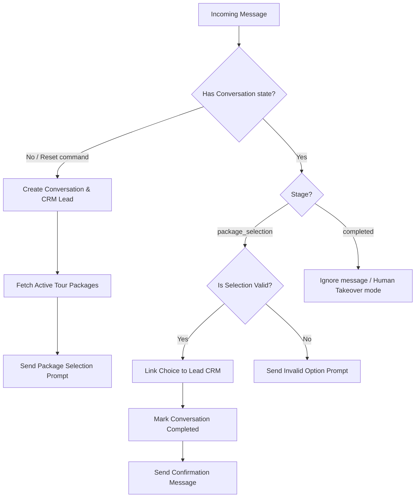

# WhatsApp Lead Automation System

A production-ready, modular WhatsApp Lead Automation server built with **TypeScript**, **Node.js/Express**, **Supabase**, and **Twilio**.

This service automates lead intake and interested-package capturing directly from WhatsApp conversations. It handles incoming Twilio webhooks, validates request signatures, tracks stateful user sessions, checks for duplicate lead entries, creates new CRM records, and manages user selection prompts.

---

## 📂 Project Structure

```text
whatsapp-lead-automation/
├── db/
│   └── migrations/
│       └── 01_create_tables.sql      # Database migrations (Supabase setup)
├── src/
│   ├── config/
│   │   └── env.ts                    # Strong Zod validation for configuration settings
│   ├── controllers/
│   │   └── webhookController.ts      # Automated conversation logic and state machine
│   ├── middleware/
│   │   └── twilioValidator.ts        # Request signature validation middleware
│   ├── routes/
│   │   └── api.ts                    # Routing endpoints mapping
│   ├── services/
│   │   ├── supabaseService.ts        # Supabase API logic wrapper (Leads, Packages, States)
│   │   └── twilioService.ts          # Twilio API logic wrapper (Sending WhatsApp messages)
│   ├── types/
│   │   └── index.ts                  # Shared TypeScript interfaces & types
│   ├── app.ts                        # Main Express app settings
│   └── server.ts                     # Startup entrypoint listener
├── .env.example                      # Template variables file
├── package.json                      # Build scripts and npm dependencies
├── tsconfig.json                     # TypeScript configurations
└── README.md                         # Project documentation
```

---

## 🛠️ Step-by-Step Setup

### 1. Database Migrations (Supabase)
Execute the SQL instructions in `db/migrations/01_create_tables.sql` inside your **Supabase SQL Editor** dashboard. This will:
* Create the `tour_packages` and `whatsapp_conversations` tables.
* Enable Row Level Security (RLS) on both.
* Grant full operations permissions to the `service_role` key.
* Add CRM columns (`selected_package`, `selection_timestamp`) to the `leads` table.
* Populate sample active tour packages to start testing immediately.

### 2. Environment Variables configuration
Rename `.env.example` to `.env` in the root of the `whatsapp-lead-automation` directory:
```bash
cp .env.example .env
```
Fill out the variables with your credentials:
* **`PORT`**: Local server port (defaults to 5000).
* **`TWILIO_ACCOUNT_SID` & `TWILIO_AUTH_TOKEN`**: From your Twilio Console Dashboard.
* **`TWILIO_WHATSAPP_NUMBER`**: Your Twilio WhatsApp Sandbox or Business Sender number (formatted as `whatsapp:+1XXXXXXXXXX`).
* **`SUPABASE_URL`**: From your Supabase project settings.
* **`SUPABASE_SERVICE_ROLE_KEY`**: Your service_role key to bypass database RLS rules safely on the server backend.

---

## 🚀 Running Locally

Install the required dependencies:
```bash
npm install
```

Start the local server in hot-reload development mode:
```bash
npm run dev
```

The server launches, confirming the configuration:
```text
🚀 WhatsApp Lead Automation Engine has successfully started!
📡 Server Port: 5000
🔗 Webhook URI:  http://localhost:5000/webhook/whatsapp
🔗 Health Check: http://localhost:5000/health
```

---

## 🤖 Conversation State Machine

Incoming message requests traverse a structured flow to guide prospects:



### 1. Menu Reset Actions
If a user is inside a completed or stuck thread, they can type any keyword of **`menu`**, **`restart`**, or **`start`** to return to the selection layout. This resets their conversation stage and sends the tour menu options again.

### 2. Human Takeover Mode
Once the flow transitions to the `completed` stage, automated answers are suspended. This prevents the bot from talking over human agents who step in to guide the client to final booking conversion.
